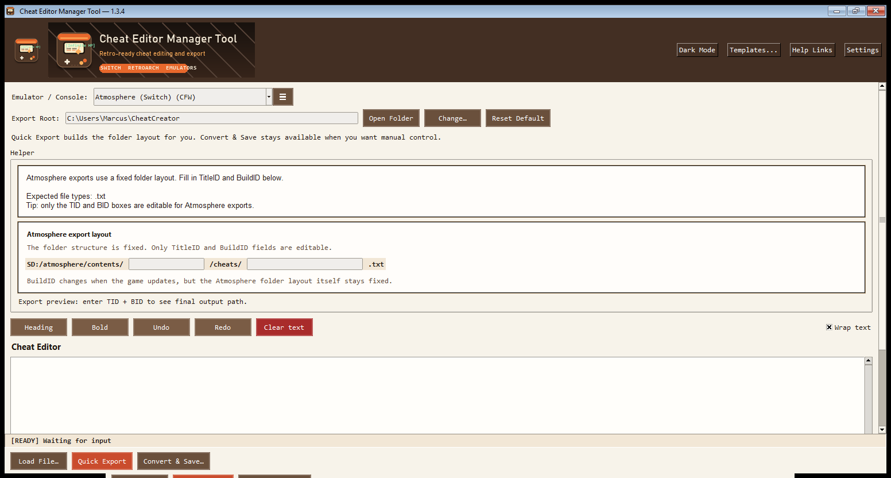

# Cheat Editor Manager Tool




Cheat Editor Manager Tool is a Windows desktop app for creating, editing, validating, and exporting cheat files to the correct folder layout for each emulator or modded console target.

## What This Program Does

- Edits cheat text safely without mixing folder path logic into the editor
- Auto-detects IDs from known file layouts when possible (Switch TID/BID, Citra, Dolphin, PPSSPP, etc.)
- Builds correct target output structure automatically with **Quick Export**
- Shows live export path preview before writing files
- Supports emulator path overrides and profile-based export logic
- Supports emulator custom profiles while preserving built-in profile safety

## Core Brand Assets

- Primary logo: `assets/primary-logo.png`
- Secondary logo: `assets/secondary-logo.png`
- Wordmark (text-only): `assets/wordmark.png`
- Logomark (symbol-only): `assets/logomark.png`
- App icon: `assets/app-icon.png` and `assets/app-icon.ico`
- Watermark: `assets/watermark-brand.png`

## Supported Targets

### Switch / CFW

- Atmosphere (Switch CFW)
- Yuzu
- Ryujinx
- Sudachi
- Suyu

### Emulator / Console Profiles

- Citra (3DS)
- RetroArch
- Dolphin
- PCSX2
- PPSSPP
- DuckStation
- Cemu
- Xenia
- RPCS3
- Nintendo 3DS (Luma)
- PSP (CFW)
- PS Vita (taiHEN)
- Wii (Homebrew)
- Wii U (CFW)

## Quick Start

1. Select a target profile.
2. Load or paste cheat text.
3. Fill required ID fields (TID/BID or profile ID).
4. Click **Quick Export** to write correctly structured output.

## Build (Windows)

```bash
python -m PyInstaller --clean --noconfirm cheat_editor_manager_tool.spec
```

Output executable:

`dist/cheat_editor_manager_tool.exe`

## Download

Latest releases page:

`https://github.com/Awetspoon/cheat_editor_manager_tool/releases/latest`

## License

MIT License. See [LICENSE](LICENSE).