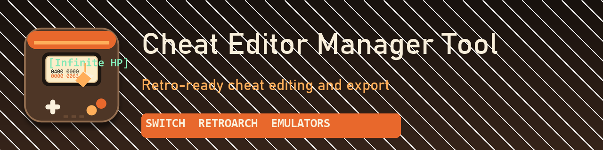

# Cheat Editor Manager Tool




> Retro-ready cheat editing and export.
> Built for Switch cheats, RetroArch, emulator patches, and modded console workflows.

------------------------------------------------------------------------
# 🚀 What Is This?

**Cheat Editor Manager Tool** is a desktop application that allows you
to:

-   ✔ Edit cheat files safely
-   ✔ Automatically build correct folder structures
-   ✔ Detect Switch TitleID (TID) & BuildID (BID)
-   ✔ Export to the correct emulator format
-   ✔ Manage custom emulator profiles
-   ✔ Preview export paths before writing files
-   ✔ Avoid broken folder structures

You don't need to know where cheats go.\
The program handles it.

------------------------------------------------------------------------

# 🧠 Who Is This For?

-   🎮 Emulator users\
-   🔓 Switch CFW users\
-   🕹 RetroArch users\
-   🧩 Modded console users\
-   👶 Beginners who don't understand folder structures\
-   🛠 Advanced users who want full control

------------------------------------------------------------------------

# 🖥 Supported Platforms

## 🧰 PC Emulators

-   Yuzu\
-   Ryujinx\
-   RetroArch (multi-core support)\
-   Dolphin\
-   PCSX2\
-   PPSSPP\
-   DuckStation\
-   RPCS3\
-   Cemu\
-   Xenia

## 🔓 Switch Custom Firmware

-   Atmosphère (CFW)

## 🧩 Modded Consoles

-   Nintendo 3DS (Luma)
-   PSP (CFW)
-   PS Vita (taiHEN)
-   Wii (Homebrew)
-   Wii U (CFW)

You can also create your own custom profile.

------------------------------------------------------------------------

# 🧭 How To Use

## 1️⃣ Select Your Emulator / Console

Choose your platform at the top of the app.

This controls:

-   Folder structure\
-   File extension\
-   Export behaviour\
-   Helper instructions

------------------------------------------------------------------------

## 2️⃣ Load A Cheat File (Optional)

Click **Load File...**

If it's a Switch cheat file:

-   ✔ TitleID auto-detected\
-   ✔ BuildID auto-detected\
-   ✔ Editor remains cheat-text only

RetroArch cheat files will auto-detect the core folder when possible.

------------------------------------------------------------------------

## 3️⃣ Edit Your Cheats

Use the Cheat Editor to:

-   Add cheats\
-   Modify codes\
-   Remove cheats\
-   Undo / Redo\
-   Add headings\
-   Clear safely

The editor contains cheat text only --- never folder paths.

------------------------------------------------------------------------

## 4️⃣ Quick Export (Recommended)

Click **Quick Export**

The program automatically builds the correct folder structure.

### Example Structures

**Atmosphère**

    atmosphere/contents/<TID>/cheats/<BID>.txt

**Yuzu**

    load/<TID>/<Cheat Name>/cheats/<BID>.txt

**RetroArch**

    cheats/<Core Name>/<Game>.cht

**Dolphin**

    GameSettings/<GameID>.ini

No manual folder creation required.

------------------------------------------------------------------------

## 5️⃣ Convert & Save (Advanced)

Use this when you want to:

-   Choose your own folder\
-   Pick a custom extension\
-   Rename the file

------------------------------------------------------------------------

# 🧩 Smart Features (v1.3.2)

-   🔄 Unified export builder (single source of truth)
-   👁 Live export path preview
-   🧠 RetroArch smart core detection
-   🎨 Improved Appearance system
-   🌙 Custom mode safety guard for quick toggle
-   🗂 Toolbar button colour control
-   📋 Clearer Dark mode readability
-   🔧 Reset to Dark/Light preset prompt

------------------------------------------------------------------------

# 🎨 Appearance

-   Dark / Light default modes\
-   Full Custom colour mode\
-   Reset to preset themes\
-   Toolbar button styling\
-   Automatic save on close

Custom mode disables quick theme toggle for clarity.

------------------------------------------------------------------------

# 🛠 Custom Profiles

Create your own emulator or CFW profile.

Define:

-   Folder structure\
-   File extension\
-   Helper instructions

Built-in profiles remain protected.

------------------------------------------------------------------------

# ⚙ Advanced

-   Override export paths (optional)
-   Remember window size
-   Path validation
-   ID parsing safeguards

Defaults are safe.

------------------------------------------------------------------------

# 🔒 Design Philosophy

The editor contains cheat text only.

IDs, folder paths, and structure are handled by the tool.

This prevents:

-   Broken exports\
-   Wrong folder placement\
-   Incorrect file naming

------------------------------------------------------------------------

# 📦 Building The Program

Using PyInstaller:

``` bash
python -m PyInstaller --clean --noconfirm cheat_editor_manager_tool.spec
```

------------------------------------------------------------------------

# 🎯 Goal Of The Tool

You focus on editing cheats.

The program handles:

-   Structure\
-   Format\
-   Extensions\
-   Export safety

------------------------------------------------------------------------

# 🧑‍💻 Credits

Concept & Design: Marcus\
Development Support: ChatGPT

------------------------------------------------------------------------

# 📜 License

MIT License. See `LICENSE`.

