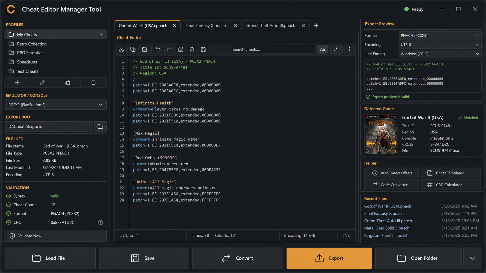

# Cheat Editor Manager Tool Redesign Plan

This plan tracks the full professional cleanup and redesign of the app.

The agreed order is:

1. Fix the skeleton and structure first.
2. Rewire the app cleanly.
3. Apply the visual redesign after the structure is stable.
4. Verify the app with compile, tests, packaged build, and launch checks.

The redesign concept image is locked in as the visual target:



The mockup is a guide for layout and polish. It must not introduce fake screens, fake services, fake buttons, or behaviour that is not wired to the real app.

## Design Rules

- Keep the app as a practical Windows desktop utility.
- Preserve the core purpose: create, edit, validate, and export cheat files.
- Do not replace working logic with visual-only placeholders.
- Use one clear brand mark in the header. Do not bring back the duplicated top-left watermark.
- Keep the editor central and easy to read.
- Keep helper/export information visible without crowding the editor.
- Keep buttons wired to real commands only.
- Keep folder, service, storage, and UI responsibilities separate.
- Run verification after each major structural or wiring change.

## Phase 1: Baseline Lock

Purpose: record what already works before moving code.

Structural checklist:

- [x] Confirm the app entry flow: `cheat_editor_manager_tool.py` to package startup to `App().run()`.
- [x] Confirm the packaged executable still launches.
- [x] Confirm source launch limitation is local Python/Tk related, not app-code related.
- [x] Record current test status.
- [x] Record current build status.
- [x] Record known dirty/untracked files so user work is not overwritten.
- [x] Confirm which files are runtime code, docs, assets, tests, hooks, and vendor files.

Redesign checklist:

- [x] Save the redesign concept image in `docs/redesign-concept.png`.
- [x] Confirm the redesign target keeps the app as a utility, not a landing page.
- [x] Confirm no duplicate top-left watermark/mark is allowed.
- [x] Confirm every visible command in the redesign has a real matching app action.

Definition of done:

- [x] The current working state is understood and documented.
- [x] The redesign image is safely stored in the repo as planning reference.

Baseline result, 2026-06-01:

- App entry flow is `cheat_editor_manager_tool.py` -> `cheat_editor_manager.__main__.main()` -> `App().run()`.
- Current working tree is intentionally dirty from the cleanup/redesign preparation; do not overwrite these changes without checking them.
- Runtime code is under `cheat_editor_manager/`; tests are under `tests/`; utility scripts are under `scripts/`; runtime assets are under `assets/`; planning/current docs are under `docs/`; PyInstaller support is under `hooks/`; vendored Tcl/Tk runtime files are under `vendor/tcl/`.
- `python -m compileall -q cheat_editor_manager tests scripts hooks` passed.
- `python -m unittest discover -s tests -q` passed: 33 tests.
- The first baseline run of `python scripts/check_dev_environment.py` confirmed Pillow and PyInstaller were importable, warned that `pytest` and `tkinterdnd2` were not importable, and exposed a Tcl/Tk startup-path problem.
- That startup-path problem has now been fixed by the Tcl/Tk runtime repair recorded below.
- `python -m PyInstaller --clean --noconfirm cheat_editor_manager_tool.spec` passed.
- `dist/cheat_editor_manager_tool.exe` smoke-launched successfully and stayed alive until the test process was closed.

## Phase 2: Target Skeleton

Purpose: define the clean project shape before moving behaviour.

Target structure:

```text
cheat_editor_manager/
  __main__.py
  app.py
  app_actions.py
  bootstrap.py
  constants.py
  export_logic.py
  profiles.py
  resources.py
  services/
  storage/
  ui/
    dialogs/
    panels/
tests/
scripts/
assets/
docs/
hooks/
vendor/
```

Structural checklist:

- [x] Keep startup files small and clear.
- [x] Keep pure export/path rules in `export_logic.py`.
- [x] Keep app orchestration in services.
- [x] Keep preference/template file access in storage modules.
- [x] Keep reusable UI helpers in `cheat_editor_manager/ui/widgets.py`.
- [x] Add `cheat_editor_manager/ui/panels/` only when panel modules are moved there.
- [x] Avoid empty architecture folders that do not yet contain real code.
- [x] Update imports immediately after any file move.

Redesign checklist:

- [ ] Map the mockup into real panels:
  - Header
  - Profile/export-root controls
  - Helper/target layout panel
  - Cheat editor panel
  - Export preview panel
  - Bottom action/status area
- [ ] Confirm each panel has a real source of data or behaviour.
- [ ] Confirm the layout can work at the current default window size.

Definition of done:

- [ ] The future skeleton is agreed and documented.
- [ ] No code has been moved without a clear destination.

Phase 2 progress, 2026-06-01:

- Added real panel modules under `cheat_editor_manager/ui/panels/`; this folder is not empty scaffolding.
- Moved header construction into `ui/panels/header_panel.py`.
- Moved emulator/profile and export-root controls into `ui/panels/profile_panel.py`.
- Moved helper, profile-specific target layout cards, TID/BID/core controls, live-preview traces, and path preview label into `ui/panels/helper_panel.py`.
- Moved editor toolbar, wrap control, text editor, scrollbars, optional drag/drop binding, editor shortcuts, and modified-event binding into `ui/panels/editor_panel.py`.
- Moved the fixed bottom action bar and status bar into `ui/panels/action_bar.py`.
- Updated `app.py` to call the panel builders while keeping the existing app commands and variables.
- Removed header imports that became unused after the move.
- Removed helper imports that became unused after the move.
- Verification after the move:
  - `python -m compileall -q cheat_editor_manager tests scripts hooks` passed.
  - `python -m unittest discover -s tests -q` passed: 33 tests.
  - `python -m PyInstaller --clean --noconfirm cheat_editor_manager_tool.spec` passed.
  - `dist/cheat_editor_manager_tool.exe` smoke-launched successfully and stayed alive until the test process was closed.
- Second verification after the helper panel move:
  - `python -m compileall -q cheat_editor_manager tests scripts hooks` passed.
  - `python -m unittest discover -s tests -q` passed: 33 tests.
  - `python -m PyInstaller --clean --noconfirm cheat_editor_manager_tool.spec` passed.
  - `dist/cheat_editor_manager_tool.exe` smoke-launched successfully and stayed alive until the test process was closed.
- Third verification after the editor panel move:
  - `python -m compileall -q cheat_editor_manager tests scripts hooks` passed.
  - `python -m unittest discover -s tests -q` passed: 33 tests.
  - `python -m PyInstaller --clean --noconfirm cheat_editor_manager_tool.spec` passed.
  - `dist/cheat_editor_manager_tool.exe` smoke-launched successfully and stayed alive until the test process was closed.
- Simplified package startup so `cheat_editor_manager/__main__.py` only creates and runs `App`.
- Kept Tcl/Tk runtime setup inside `App.__init__` so direct `App()` creation still prepares the runtime before creating the Tk root window.
- Verification after startup cleanup:
  - `python -m compileall -q cheat_editor_manager tests scripts hooks` passed.
  - `python -m unittest discover -s tests -q` passed: 33 tests.
  - `python -m PyInstaller --clean --noconfirm cheat_editor_manager_tool.spec` passed.
  - `dist/cheat_editor_manager_tool.exe` smoke-launched successfully and stayed alive until the test process was closed.
- Moved Tk/ttk style setup and theme application out of `app.py` into `ui/theme.py`.
- Kept pure colour math and contrast helpers in `services/theme_service.py`.
- Kept `App._build_styles()` and `App.apply_theme()` as stable wrappers so dialogs/tests can keep using the same app API.
- Verification after the UI theme split:
  - `python -m compileall -q cheat_editor_manager tests scripts hooks` passed.
  - `python -m unittest discover -s tests -q` passed: 33 tests.
  - `python -m PyInstaller --clean --noconfirm cheat_editor_manager_tool.spec` passed.
  - `dist/cheat_editor_manager_tool.exe` smoke-launched successfully and stayed alive until the test process was closed.
- `app.py` is now down to 819 lines after panel and theme splits.
- Moved helper layout visibility, target-card text updates, profile helper text generation, and helper-triggered export preview refresh into `ui/panels/helper_panel.py`.
- Kept `App.refresh_profile_info()`, `App._refresh_target_cards()`, and `App._show_*()` as stable wrappers for existing services/dialogs.
- Verification after the helper refresh split:
  - `python -m compileall -q cheat_editor_manager tests scripts hooks` passed.
  - `python -m unittest discover -s tests -q` passed: 33 tests.
  - `python -m PyInstaller --clean --noconfirm cheat_editor_manager_tool.spec` passed.
  - `dist/cheat_editor_manager_tool.exe` smoke-launched successfully and stayed alive until the test process was closed.
- `app.py` is now down to 700 lines after panel, theme, and helper refresh splits.
- Moved editor commands for heading, bold, undo, redo, clear, wrap, and drag/drop file handling into `ui/panels/editor_panel.py`.
- Kept `App.fmt_heading()`, `App.fmt_bold()`, `App.do_undo()`, `App.do_redo()`, `App.clear_editor()`, `App.toggle_wrap()`, and `App._on_drop_files()` as stable wrappers for existing bindings.
- Verification after the editor command split:
  - `python -m compileall -q cheat_editor_manager tests scripts hooks` passed.
  - `python -m unittest discover -s tests -q` passed: 33 tests.
  - `python -m PyInstaller --clean --noconfirm cheat_editor_manager_tool.spec` passed.
  - `dist/cheat_editor_manager_tool.exe` smoke-launched successfully and stayed alive until the test process was closed.
- `app.py` is now down to 669 lines after panel, theme, helper refresh, and editor command splits.
- Moved right-click context-menu construction, popup handling, and cut/copy/paste/delete/select-all actions into `ui/context_menu.py`.
- Kept `App._show_ctx_menu()` and `App._ctx_action()` as stable wrappers for existing Tk class bindings.
- Verification after the context-menu split:
  - `python -m compileall -q cheat_editor_manager tests scripts hooks` passed.
  - `python -m unittest discover -s tests -q` passed: 33 tests.
  - `python -m PyInstaller --clean --noconfirm cheat_editor_manager_tool.spec` passed.
  - `dist/cheat_editor_manager_tool.exe` smoke-launched successfully and stayed alive until the test process was closed.
- `app.py` is now down to 609 lines after panel, theme, helper refresh, editor command, and context-menu splits.
- Moved profile dropdown refresh and export-root open/change/reset commands into `ui/panels/profile_panel.py`.
- Kept `App.refresh_profiles_dropdown()`, `App.change_root()`, `App.open_export_root()`, and `App.reset_export_root()` as stable wrappers for existing UI bindings.
- Removed now-unused app-level imports for profile/export-root handling.
- Verification after the profile/export command split:
  - `python -m compileall -q cheat_editor_manager tests scripts hooks` passed.
  - `python -m unittest discover -s tests -q` passed: 33 tests.
  - `python -m PyInstaller --clean --noconfirm cheat_editor_manager_tool.spec` passed.
  - `dist/cheat_editor_manager_tool.exe` smoke-launched successfully and stayed alive until the test process was closed.
- `app.py` is now down to 546 lines after panel, theme, helper refresh, editor command, context-menu, and profile/export command splits.
- Added `app_actions.py` with `ExportFileActionsMixin` for stable Tk callback methods used by file loading, export preview, Convert & Save, and Quick Export.
- Kept the real export work in `services/export_service.py`, file loading in `services/file_load_service.py`, and pure export/path rules in `export_logic.py`.
- Removed direct export/file service imports and export wrapper methods from `app.py`.
- Cleaned the app close-handler indentation and trailing blank space while working in the same section.
- Verification after the export/file action split:
  - `python -m compileall -q cheat_editor_manager tests scripts hooks` passed.
  - `python -m unittest discover -s tests -q` passed: 33 tests.
  - `python -m PyInstaller --clean --noconfirm cheat_editor_manager_tool.spec` passed.
  - `dist/cheat_editor_manager_tool.exe` smoke-launched successfully and stayed alive until the test process was closed.
- `app.py` is now down to 473 lines after panel, theme, helper refresh, editor command, context-menu, profile/export command, and export/file action splits.
- Added `services/retroarch_core_service.py` for RetroArch core list normalization, current-core selection, add, rename, and remove rules.
- Moved RetroArch core preference cleanup out of `ui/dialogs/retroarch_cores_dialog.py`; the dialog now asks the service to do core-list work.
- Added `RetroarchCoreActionsMixin` to `app_actions.py` so startup/core dropdown callbacks no longer import non-dialog logic from a dialog module.
- Added `tests/test_retroarch_core_service.py` to cover core de-duplication, current-core reset, rename, and remove behaviour.
- Verification after the RetroArch core service split:
  - `python -m compileall -q cheat_editor_manager tests scripts hooks` passed.
  - `python -m unittest discover -s tests -q` passed: 36 tests.
  - `python -m PyInstaller --clean --noconfirm cheat_editor_manager_tool.spec` passed.
  - `dist/cheat_editor_manager_tool.exe` smoke-launched successfully and stayed alive until the test process was closed.
- `app.py` is now down to 462 lines after the RetroArch service split.
- Added `services/template_service.py` for profile-aware helper snippets used by the Templates dialog.
- Moved helper-snippet generation out of `ui/dialogs/templates_dialog.py`; the dialog still owns the window and editor actions, while the service owns the snippet rules.
- Added `tests/test_template_service.py` to cover Switch, Citra/TitleID, and RetroArch helper snippets.
- Verification after the Templates dialog service split:
  - `python -m compileall -q cheat_editor_manager tests scripts hooks` passed.
  - `python -m unittest discover -s tests -q` passed: 39 tests.
  - `python -m PyInstaller --clean --noconfirm cheat_editor_manager_tool.spec` passed.
  - `dist/cheat_editor_manager_tool.exe` smoke-launched successfully and stayed alive until the test process was closed.
- Originally split the Settings dialog Advanced area out of `settings_dialog.py`;
  it was later rebuilt as `ui/dialogs/settings_export_roots_page.py`.
- Kept export-root override behaviour unchanged: the tab still edits `prefs["emulator_paths"]`, and Settings still saves preferences on close/apply.
- `settings_dialog.py` was reduced after the original Advanced area split.
- Verification after the original Settings Advanced area split:
  - `python -m compileall -q cheat_editor_manager tests scripts hooks` passed.
  - `python -m unittest discover -s tests -q` passed: 39 tests.
  - `python -m PyInstaller --clean --noconfirm cheat_editor_manager_tool.spec` passed.
  - `dist/cheat_editor_manager_tool.exe` smoke-launched successfully and stayed alive until the test process was closed.
- Moved the Settings dialog Profiles page into `ui/dialogs/settings_profiles_page.py`.
- Kept custom profile behaviour unchanged: add, edit, delete, helper-note limit, preference save, profile dropdown refresh, and helper refresh still run through the same app methods.
- Updated the Appearance live preview so it themes the Profiles page through its `apply_theme()` method instead of reaching into the Profiles widgets directly.
- `settings_dialog.py` was reduced after the Profiles page split.
- Verification after the Settings Profiles page split:
  - `python -m compileall -q cheat_editor_manager tests scripts hooks` passed.
  - `python -m unittest discover -s tests -q` passed: 39 tests.
  - `python -m PyInstaller --clean --noconfirm cheat_editor_manager_tool.spec` passed.
  - `dist/cheat_editor_manager_tool.exe` smoke-launched successfully and stayed alive until the test process was closed.
- Moved the Settings dialog Appearance page into `ui/dialogs/settings_appearance_page.py`.
- Kept theme behaviour unchanged: live preview still updates the main app, Settings canvas, Profiles page list, and Appearance page canvas; Settings still saves theme/font preferences on close/apply.
- `settings_dialog.py` is now down to 45 lines and acts as the Settings window coordinator.
- Verification after the Settings Appearance page split:
  - `python -m compileall -q cheat_editor_manager tests scripts hooks` passed.
  - `python -m unittest discover -s tests -q` passed: 39 tests.
  - `python -m PyInstaller --clean --noconfirm cheat_editor_manager_tool.spec` passed.
  - `dist/cheat_editor_manager_tool.exe` smoke-launched successfully and stayed alive until the test process was closed.
- Added `services/help_link_service.py` for help-link normalization, display names, add, replace, delete, move, and default reset rules.
- Moved Help Links list editing rules out of `ui/dialogs/help_links_dialog.py`; the dialog still owns the window, prompts, and button wiring.
- Added `tests/test_help_link_service.py` to cover normalization, display names, list edits, movement, and default-link copying.
- Verification after the Help Links service split:
  - `python -m compileall -q cheat_editor_manager tests scripts hooks` passed.
  - `python -m unittest discover -s tests -q` passed: 44 tests.
  - `python -m PyInstaller --clean --noconfirm cheat_editor_manager_tool.spec` passed.
  - `dist/cheat_editor_manager_tool.exe` smoke-launched successfully and stayed alive until the test process was closed.
- Header/brand cleanup started:
  - Rebuilt `ui/panels/header_panel.py` as a compact brand-left/actions-right header.
  - Removed the large `wordmark-360.png` from the runtime header path because that bitmap already contains a logo mark and could reintroduce duplicated top-left branding.
  - Kept one runtime header mark through `mark-48.png`, with code-native app title/subtitle text beside it.
  - Added `header_actions` so Settings, Help Links, Templates, and Dark Mode buttons are styled as one consistent action strip.
  - Updated `ui/theme.py` so the header border, title text, subtitle text, and header buttons respond to light/dark/custom button colours.
  - Added `CHEAT_EDITOR_MANAGER_SMOKE_EXIT=1` startup smoke support in `cheat_editor_manager/__main__.py`.
  - Updated startup RetroArch-core auditing so it does not write preferences when nothing changed, and records a startup warning if a required cleanup save is blocked.
  - Added `tests/test_app_actions.py` for the startup RetroArch audit save behaviour.
- Verification after the Header/Brand cleanup:
  - `python -m compileall -q cheat_editor_manager tests scripts hooks` passed.
  - `python -m unittest discover -s tests -q` passed: 46 tests.
  - `python -m PyInstaller --clean --noconfirm cheat_editor_manager_tool.spec` passed.
  - Initial source and packaged smoke checks exposed a Tcl/Tk startup-path problem that was fixed in the follow-up runtime repair.
- Tcl/Tk runtime repair:
  - Added Windows extended-path handling in `bootstrap.py` so source and frozen runs point Tk at usable Tcl/Tk script folders.
  - Updated the PyInstaller runtime hook to use the same Windows-safe Tcl/Tk path format.
  - Added `tk_file_path()` in `resources.py` so Tk image/icon loading also works from paths with spaces.
  - Updated `scripts/check_dev_environment.py` so it checks the app's vendored Tcl/Tk runtime instead of only raw Python's default Tcl folder.
  - Added `tests/test_bootstrap.py` coverage for Tcl/Tk and Tk asset path normalisation.
  - Confirmed `mark-48.png` loads in the packaged app header; the fallback `CEM` text is no longer used when the asset exists.
- Verification after the Tcl/Tk runtime repair:
  - Source smoke mode passed with `CHEAT_EDITOR_MANAGER_SMOKE_EXIT=1`.
  - `python scripts/check_dev_environment.py` passed.
  - `python -m compileall -q cheat_editor_manager tests scripts hooks` passed.
  - `python -m unittest discover -s tests -q` passed: 48 tests.
  - `python -m PyInstaller --clean --noconfirm cheat_editor_manager_tool.spec` passed.
  - Packaged smoke mode passed with `CHEAT_EDITOR_MANAGER_SMOKE_EXIT=1`.
  - Packaged app opened successfully; PyInstaller creates a hidden launcher process and the real Tk window in a child process.
  - Visual QA screenshot confirmed one compact top-left header mark and no duplicated wordmark/watermark.
- Next target: continue the visual redesign past the header, starting with the profile/export controls.
- Profile/export controls redesign:
  - Reworked `ui/panels/profile_panel.py` into one clear setup band with `Target` and `Export Root` groups.
  - Kept the same profile dropdown, export-root entry, Open Folder, Change, and Reset Default commands.
  - Kept `profile_var`, `export_var`, and `info_var` as the same source variables used by helper text and export preview wiring.
  - Moved the existing Quick Export guidance into the setup band instead of leaving it detached below the rows.
  - Added theme support in `ui/theme.py` so the setup band follows light, dark, and custom colour modes.
- Profile sort button cleanup:
  - Removed the separate Target dropdown menu button and its popup sort menu wiring.
  - Removed the old `profile_sort` preference path so the Target dropdown has one clear default order.
- Verification after the Profile/Export controls redesign:
  - `python scripts/check_dev_environment.py` passed.
  - `python -m compileall -q cheat_editor_manager tests scripts hooks` passed.
  - `python -m unittest discover -s tests -q` passed: 48 tests.
  - Source smoke mode passed with `CHEAT_EDITOR_MANAGER_SMOKE_EXIT=1`.
  - Visual QA screenshot confirmed the controls are grouped cleanly at the default window size.
  - `python -m PyInstaller --clean --noconfirm cheat_editor_manager_tool.spec` passed.
  - Packaged smoke mode passed with `CHEAT_EDITOR_MANAGER_SMOKE_EXIT=1`.
- Next target: continue the visual redesign with the helper and target layout panel.
- Helper/target layout redesign:
  - Reworked `ui/panels/helper_panel.py` from a default `LabelFrame` into a themed `Target Guide` panel.
  - Kept the same real profile-driven layout system: Atmosphere, Switch, ID-based, RetroArch, and generic cards.
  - Kept the same `tid_var`, `bid_var`, `core_var`, and export-preview trace wiring.
  - Placed profile guidance beside the active target layout so the helper information is visible without pushing the editor too far down.
  - Moved the export preview into a dedicated preview strip inside the helper panel so it is easier to find.
  - Updated `app.py` helper wrapping so guidance text, layout text, and preview text wrap to their real panel widths.
  - Updated `ui/theme.py` so the helper header, guidance card, active layout card, and preview strip follow light, dark, and custom colour modes.
  - Fixed the title-ID template strip theme handling so it matches the other template strips.
- Verification after the Helper/Target layout redesign:
  - GUI profile switching check passed for Atmosphere, Yuzu, Citra, RetroArch, and RPCS3; each showed exactly one active layout card.
  - `python scripts/check_dev_environment.py` passed.
  - `python -m compileall -q cheat_editor_manager tests scripts hooks` passed.
  - `python -m unittest discover -s tests -q` passed: 48 tests.
  - Source smoke mode passed with `CHEAT_EDITOR_MANAGER_SMOKE_EXIT=1`.
  - Visual QA screenshot confirmed the helper panel is readable and the editor keeps usable vertical space.
  - `python -m PyInstaller --clean --noconfirm cheat_editor_manager_tool.spec` passed.
  - Packaged smoke mode passed with `CHEAT_EDITOR_MANAGER_SMOKE_EXIT=1`.
- Next target: continue the visual redesign with the cheat editor panel.
- Cheat editor panel redesign:
  - Reworked `ui/panels/editor_panel.py` into one clear `Cheat Editor` workspace panel.
  - Kept Heading, Bold, Undo, Redo, Clear text, Wrap text, scrollbars, drag/drop, keyboard shortcuts, and modified-event preview updates wired to the same commands.
  - Moved the wrap control into the editor header and kept toolbar actions attached to the editor instead of floating above it.
  - Kept the text widget as the central workspace and retained undo history settings.
  - Added theme support in `ui/theme.py` for the editor panel, header, toolbar, text frame, and wrap checkbox.
- Verification after the Cheat Editor panel redesign:
  - GUI editor command check passed for text entry, Heading, Bold, Undo, and Redo wiring.
  - `python scripts/check_dev_environment.py` passed.
  - `python -m compileall -q cheat_editor_manager tests scripts hooks` passed.
  - `python -m unittest discover -s tests -q` passed: 48 tests.
  - Source smoke mode passed with `CHEAT_EDITOR_MANAGER_SMOKE_EXIT=1`.
  - Visual QA screenshot confirmed the editor reads as the main workspace and keeps usable height.
  - `python -m PyInstaller --clean --noconfirm cheat_editor_manager_tool.spec` passed.
  - Packaged smoke mode passed with `CHEAT_EDITOR_MANAGER_SMOKE_EXIT=1`.
- Next target: continue with export preview and bottom actions.
- Export preview and bottom actions redesign:
  - Kept the export preview as one source of truth in the helper panel through `export_service.update_export_preview()`.
  - Reworked `ui/panels/action_bar.py` into one themed footer instead of loose root-level status/action rows.
  - Kept the same `status` variable and the same Load File, Quick Export, and Convert & Save commands.
  - Kept Quick Export visually primary and Load File / Convert & Save as secondary actions.
  - Updated `ui/theme.py` so the footer, action row, and status strip follow light, dark, and custom colour modes.
- Verification after the Export Preview/Actions redesign:
  - GUI wiring check passed for footer button command registration, status updates, and real export-preview generation from TID/BID/editor input.
  - `python scripts/check_dev_environment.py` passed.
  - `python -m compileall -q cheat_editor_manager tests scripts hooks` passed.
  - `python -m unittest discover -s tests -q` passed: 48 tests.
  - Source smoke mode passed with `CHEAT_EDITOR_MANAGER_SMOKE_EXIT=1`.
  - Visual QA screenshot confirmed the footer/status/actions match the redesigned main screen.
  - `python -m PyInstaller --clean --noconfirm cheat_editor_manager_tool.spec` passed.
  - Packaged smoke mode passed with `CHEAT_EDITOR_MANAGER_SMOKE_EXIT=1`.
- Next target: audit and visually align the dialogs.
- Dialog visual alignment:
  - Added `ui/dialogs/dialog_utils.py` for shared dialog window setup, headers, footers, scroll bodies, and live theme refresh.
  - Kept Settings, Templates, Help Links, RetroArch Cores, and custom profile editing in `ui/dialogs/`.
  - Moved Settings to a fixed shell: header at the top, notebook in the middle, and Close footer pinned at the bottom.
  - Applied the shared shell/header treatment to Templates, Help Links, RetroArch Cores, and the custom profile editor.
  - Kept all existing real actions: template insert/load/save/reset, help-link open/add/edit/delete/move/reset, RetroArch core add/edit/remove, and settings save.
  - Tidied the shared text prompt so small entry dialogs inherit the app window styling.
- Verification after the Dialog visual alignment:
  - Dialog GUI smoke passed for Help Links, RetroArch Cores, Templates, and Settings using a temporary prefs file in `build/dialog-smoke/`.
  - `python scripts/check_dev_environment.py` passed.
  - `python -m compileall -q cheat_editor_manager tests scripts hooks` passed.
  - `python -m unittest discover -s tests -q` passed: 48 tests.
  - Source smoke mode passed with `CHEAT_EDITOR_MANAGER_SMOKE_EXIT=1`.
  - Visual QA screenshot saved at `build/dialogs-qa.png`.
  - `python -m PyInstaller --clean --noconfirm cheat_editor_manager_tool.spec` passed.
  - Packaged smoke mode passed with `CHEAT_EDITOR_MANAGER_SMOKE_EXIT=1`.
- Next target: continue with services and logic cleanup.
- Services and logic cleanup:
  - Moved live export preview message construction into `export_logic.build_export_preview_message()` so preview text is pure, testable, and close to the real export rules.
  - Kept `export_service.py` as the app-facing export orchestration layer: it reads app state, calls pure export logic, updates preview/status, and handles save/export operations.
  - Moved the Convert & Save extension picker UI into `ui/dialogs/extension_dialog.py`.
  - Added `export_service.extension_options_for_profile()` so extension lists are calculated by the service and displayed by the dialog.
  - Moved RetroArch core-name comparison into `retroarch_core_service.normalize_core_name()` and updated file loading to use it.
  - Removed the duplicated RetroArch default-core label from file loading.
- Verification after the Services and Logic cleanup:
  - `python scripts/check_dev_environment.py` passed.
  - `python -m compileall -q cheat_editor_manager tests scripts hooks` passed.
  - `python -m unittest discover -s tests -q` passed: 53 tests.
  - Source smoke mode passed with `CHEAT_EDITOR_MANAGER_SMOKE_EXIT=1`.
  - Focused GUI smoke passed for live export preview and the moved extension picker.
  - `python -m PyInstaller --clean --noconfirm cheat_editor_manager_tool.spec` passed.
  - Packaged smoke mode passed with `CHEAT_EDITOR_MANAGER_SMOKE_EXIT=1`.
- Next target: continue with data and storage cleanup.
- Data and storage cleanup:
  - Split `storage/prefs_store.py` preference loading into clear helper steps for reading raw prefs, removing stale keys, applying branding migrations, ensuring preference shapes, and cleaning custom profile data.
  - Reused `retroarch_core_service.ensure_core_preferences()` inside preference loading instead of keeping a second RetroArch normalization path in storage.
  - Kept the existing preference keys: export root, emulator overrides, custom profiles, templates defaults, theme settings, and RetroArch core settings.
  - Kept custom profile `export_root` cleanup so profile-specific export roots stay in the Export Roots page instead of inside profile definitions.
  - Tightened `storage/template_store.py` so profile/template names that contain only invalid Windows filename characters fall back to safe names.
  - Added focused storage tests for atomic preference saves, stale-key cleanup, RetroArch preference normalization, custom profile cleanup, and template read/write/list behaviour.
- Verification after the Data and Storage cleanup:
  - `python scripts/check_dev_environment.py` passed.
  - `python -m compileall -q cheat_editor_manager tests scripts hooks` passed.
  - `python -m unittest discover -s tests -q` passed: 57 tests.
  - Source smoke mode passed with `CHEAT_EDITOR_MANAGER_SMOKE_EXIT=1`.
  - `python -m PyInstaller --clean --noconfirm cheat_editor_manager_tool.spec` passed.
  - Packaged smoke mode passed with `CHEAT_EDITOR_MANAGER_SMOKE_EXIT=1`.
- Next target: continue with asset cleanup.
- Asset cleanup:
  - Audited runtime icon/header assets, brand-source images, screenshots, watermarks, planning images, and PyInstaller asset references.
  - Confirmed runtime code uses `app-icon.ico`, `icon-256.png`, `app-icon.png` fallback, and `mark-48.png`.
  - Confirmed the runtime header still uses one compact mark and does not load `wordmark-360.png`, `logo-header.png`, or watermark images.
  - Refreshed `assets/app-fullscreen.png` from the current app UI so the README no longer shows the old duplicated-wordmark header.
  - Removed unreferenced temporary QA preview images from `assets/`: `exe-icon-preview.png`, `runtime-window-icon.png`, and `source-icon-preview.png`.
  - Updated `assets/README.md` to separate runtime assets, retained brand-source files, aliases, README screenshot, and generated QA images.
  - Updated `assets/generate_brand_assets.py` so regenerated brand assets keep the documented friendly alias files and current asset README wording.
  - Added asset smoke tests for runtime assets, README screenshot, temporary preview cleanup, and the redesign concept staying in `docs/`.
- Verification after the Asset cleanup:
  - Visual check confirmed `assets/app-fullscreen.png` shows the current redesigned layout with one compact top-left mark.
  - `python scripts/check_dev_environment.py` passed.
  - `python -m compileall -q assets/generate_brand_assets.py cheat_editor_manager tests scripts hooks` passed.
  - `python -m unittest discover -s tests -q` passed: 61 tests.
  - Source smoke mode passed with `CHEAT_EDITOR_MANAGER_SMOKE_EXIT=1`.
  - `python -m PyInstaller --clean --noconfirm cheat_editor_manager_tool.spec` passed.
  - Packaged smoke mode passed with `CHEAT_EDITOR_MANAGER_SMOKE_EXIT=1`.
- Config and build cleanup:
  - Made `tkinterdnd2` an optional `dnd` extra in `pyproject.toml` because the app already has a safe non-drag-and-drop fallback.
  - Kept `requirements.txt` as the local packaging helper list and clearly marked `tkinterdnd2` as optional.
  - Added `MANIFEST.in` so source packages include README/license, assets, docs, hooks, and vendored Tcl/Tk runtime files while pruning generated output.
  - Expanded `.gitignore` for common generated Python/cache/coverage outputs.
  - Tidied `cheat_editor_manager_tool.spec` formatting while preserving asset, icon, hook, and Tcl/Tk packaging references.
  - Added build-config tests for dependency grouping, manifest coverage, generated-output ignores, and PyInstaller runtime asset references.
- Verification after the Config and Build cleanup:
  - `python scripts/check_dev_environment.py` passed.
  - `python -m compileall -q assets/generate_brand_assets.py cheat_editor_manager tests scripts hooks` passed.
  - `python -m unittest discover -s tests -q` passed: 65 tests.
  - Source smoke mode passed with `CHEAT_EDITOR_MANAGER_SMOKE_EXIT=1`.
  - `python -m PyInstaller --clean --noconfirm cheat_editor_manager_tool.spec` passed.
  - Packaged smoke mode passed with `CHEAT_EDITOR_MANAGER_SMOKE_EXIT=1`.
- Tests audit:
  - Reviewed the full `tests/` folder and confirmed the suite already covers export rules, file loading, storage, services, assets, build config, bootstrap path handling, theme contrast, and action-level RetroArch core cleanup.
  - Kept the existing import/theme smoke test.
  - Added real startup smoke coverage for both entry points: `cheat_editor_manager_tool.py` and `python -m cheat_editor_manager`.
  - Used the existing `CHEAT_EDITOR_MANAGER_SMOKE_EXIT=1` mode so the GUI is created, updated once, and closed automatically.
  - Added `CHEAT_EDITOR_MANAGER_SKIP_GUI_SMOKE=1` as a documented escape hatch for constrained environments.
- Verification after the Tests audit:
  - `python scripts/check_dev_environment.py` passed.
  - Focused app smoke tests passed: 3 tests.
  - `python -m compileall -q assets/generate_brand_assets.py cheat_editor_manager tests scripts hooks` passed.
  - `python -m unittest discover -s tests -q` passed: 67 tests.
  - Source smoke mode passed with `CHEAT_EDITOR_MANAGER_SMOKE_EXIT=1`.
  - `python -m PyInstaller --clean --noconfirm cheat_editor_manager_tool.spec` passed.
  - Packaged smoke mode passed with `CHEAT_EDITOR_MANAGER_SMOKE_EXIT=1`.
- Documentation cleanup:
  - Added a plain-English Main UI Sections summary to the README.
  - Added a Future Expansion Points section to show where new targets, export rules, dialogs, panels, and settings should go.
  - Added `docs/README.md` so current docs and archived docs are clearly separated.
  - Marked `docs/Cheat_File_Creator_MASTER_EXPLANATION_v1_3_2.txt` as archived historical documentation at the top of the file.
  - Updated the README project structure and maintenance notes to point at the current docs index.
  - Added documentation smoke tests so the docs index, archive warning, and README guide sections stay present.
- Verification after the Documentation cleanup:
  - Focused docs tests passed.
  - `python -m compileall -q assets/generate_brand_assets.py cheat_editor_manager tests scripts hooks` passed.
  - `python -m unittest discover -s tests -q` passed: 71 tests.
- Final cleanup:
  - Removed the unused duplicate brand-asset generator wrapper at `scripts/generate_brand_assets.py`.
  - Kept `assets/generate_brand_assets.py` as the one documented brand asset generator.
  - Added `scripts/*.py` to `MANIFEST.in` so documented utility scripts are included in source packages.
  - Updated build-config tests to protect that manifest coverage.
  - Updated `scripts/check_dev_environment.py` so `pytest` is described as an optional test runner and `tkinterdnd2` is described as optional drag-and-drop support.
  - Rechecked stale references to removed old modules, fake/TODO markers, runtime duplicate-brand paths, stale window-setting leftovers, and generated-output ignore rules.
  - Confirmed generated local folders such as `.venv`, `_tmp_mei`, `build`, and `dist` are ignored; they were left on disk because `.venv` is environment state and `dist` contains the current executable.
- Verification after the Final cleanup:
  - `python scripts/check_dev_environment.py` passed.
  - `python -m compileall -q assets/generate_brand_assets.py cheat_editor_manager tests scripts hooks` passed.
  - `python -m unittest discover -s tests -q` passed: 71 tests.
  - Source smoke mode passed with `CHEAT_EDITOR_MANAGER_SMOKE_EXIT=1`.
  - `python -m PyInstaller --clean --noconfirm cheat_editor_manager_tool.spec` passed.
  - Packaged smoke mode passed with `CHEAT_EDITOR_MANAGER_SMOKE_EXIT=1`.
  - `git diff --check` passed.
  - `pyflakes` and `ruff` could not be run because they are not installed in the current Python environment.
- Next target: final build, manual verification, and final report.

## Phase 3: Startup And Wiring

Purpose: keep the app launch path clean before deeper UI changes.

Structural checklist:

- [x] Keep `cheat_editor_manager_tool.py` as the direct Windows script entry.
- [x] Keep `cheat_editor_manager/__main__.py` as the package entry.
- [x] Keep `bootstrap.py` responsible for Tcl/Tk environment setup only.
- [x] Configure source and packaged Tcl/Tk runtime paths before Tk creates the root window.
- [x] Use Tk-safe asset paths for icons and header images.
- [x] Keep `App` creation in one place.
- [x] Check PyInstaller spec references after any path changes.
- [x] Check hooks still point at valid files.

Redesign checklist:

- [x] Do not add splash screens or visual startup behaviour unless needed.
- [x] Keep the title, icon, and brand assets wired from the existing resource helpers.
- [x] Confirm header branding still uses one wordmark/mark only.

Definition of done:

- [x] App startup path is short and understandable.
- [x] Package and direct script entry still point to the same app.

## Phase 4: Main UI Shell

Purpose: split the large app constructor into clear UI sections without changing behaviour.

Structural checklist:

- [x] Move header construction into a clear builder method or panel module.
- [x] Move profile/export-root construction into a clear builder method or panel module.
- [x] Move helper/target layout construction into a clear builder method or panel module.
- [x] Move editor construction into a clear builder method or panel module.
- [x] Move bottom action/status construction into a clear builder method or panel module.
- [x] Keep command methods on the app or a clear controller until a safer controller split is justified.
- [x] Avoid two systems doing the same UI job.

Redesign checklist:

- [x] Header matches the mockup direction: clean, compact, one brand area.
- [x] Primary controls are easier to scan.
- [x] Editor remains central and large enough to work in.
- [x] Helper/export preview are visible but not noisy.
- [x] Bottom actions stay available and wired.
- [x] No decorative-only panels are added.

Definition of done:

- [x] `app.py` is smaller and easier to follow.
- [x] Main screen still launches with all existing actions wired.

## Phase 5: Header And Brand Area

Purpose: make the app look professional without breaking branding.

Structural checklist:

- [x] Keep brand asset loading in one clear place.
- [x] Keep window icon logic separate from header image logic.
- [x] Remove any duplicate or fallback header elements that conflict with the wordmark.
- [x] Keep settings/help/templates/dark-mode buttons wired to their existing methods.

Redesign checklist:

- [x] Use exactly one top-left brand signal.
- [x] Keep header height compact.
- [x] Keep header buttons consistent.
- [x] Confirm the wordmark does not overlap or duplicate the mark.
- [x] Confirm dark/light/custom theme changes still update the header.

Definition of done:

- [x] Header is clean, professional, and not duplicated.
- [x] Header buttons remain wired to Settings, Help Links, Templates, and Dark Mode.

## Phase 6: Profile And Export Controls

Purpose: make target selection and export-root setup clear and maintainable.

Structural checklist:

- [x] Keep profile values sourced from `profiles.py` and preferences.
- [x] Keep profile sorting in one place.
- [x] Keep export root persistence in preferences.
- [x] Keep open/change/reset export-root commands wired.
- [x] Remove any unused controls or labels.

Redesign checklist:

- [x] Match the mockup's left/control area idea without creating fake navigation.
- [x] Group emulator/console and export-root controls visually.
- [x] Keep the current profile selection obvious.
- [x] Keep expected user flow clear: choose target, set root, edit, export.

Definition of done:

- [x] Profile/export controls are grouped cleanly and work exactly as before.

## Phase 7: Helper And Target Layout Panel

Purpose: make helper information useful without mixing it into backend logic.

Structural checklist:

- [x] Keep helper text generation tied to real profile data.
- [x] Keep Atmosphere, Switch, ID-based, RetroArch, and generic layout panels as one controlled system.
- [x] Remove duplicate card styling logic where possible.
- [x] Keep TitleID, BuildID, core, and template-path widgets wired to the existing variables.
- [x] Keep live preview update traces working.

Redesign checklist:

- [x] Show one clear active target layout at a time.
- [x] Make helper text readable and not look editable.
- [x] Keep path/template preview visible.
- [x] Avoid giant help blocks that push the editor too far down.

Definition of done:

- [x] The helper panel is clearer but still profile-aware.
- [x] Export preview still updates when profile/IDs/core/root changes.

## Phase 8: Cheat Editor Panel

Purpose: make the main editor feel like the primary workspace.

Structural checklist:

- [x] Keep editor text widget setup in one clear place.
- [x] Keep undo/redo/heading/bold/clear/wrap controls wired.
- [x] Keep right-click context menu behaviour working.
- [x] Keep drag-and-drop optional and safe when `tkinterdnd2` is missing.
- [x] Keep modified-event export preview updates working.

Redesign checklist:

- [x] Make the editor central in the layout.
- [x] Use a readable monospaced font.
- [x] Keep scrollbars reliable.
- [x] Use compact toolbar controls.
- [x] Do not hide essential editing commands.

Definition of done:

- [x] Editing remains stable and easier to use.

## Phase 9: Export Preview And Actions

Purpose: make the output path and export actions obvious.

Structural checklist:

- [x] Keep export plan building in `export_service.py`/`export_logic.py`.
- [x] Keep Quick Export wired to the real export service.
- [x] Keep Convert & Save wired to the real save flow.
- [x] Keep Load File wired to `file_load_service.py`.
- [x] Add an Open Folder action only if it uses the real export-root command.
- [x] Remove any preview labels that duplicate or contradict the real export preview.

Redesign checklist:

- [x] Give export preview a clear location matching the mockup.
- [x] Make primary action visually clear.
- [x] Keep secondary actions nearby but less dominant.
- [x] Keep status messages visible.

Definition of done:

- [x] User can see where files will go before exporting.
- [x] Every export action is real and tested.

## Phase 10: Dialogs

Purpose: make secondary windows consistent with the main app.

Structural checklist:

- [x] Audit settings dialog.
- [x] Audit templates dialog.
- [x] Audit help links dialog.
- [x] Audit RetroArch cores dialog.
- [x] Keep each dialog in `cheat_editor_manager/ui/dialogs/`.
- [x] Remove fake buttons or unused dialog actions.
- [x] Use shared theme helpers for listboxes and text widgets.

Redesign checklist:

- [x] Make dialogs visually consistent with the redesigned main window.
- [x] Keep dialog labels plain and practical.
- [x] Keep destructive actions clearly labelled.
- [x] Keep forms readable at normal Windows sizes.

Definition of done:

- [x] Dialogs look like part of the same app and still work.

## Phase 11: Services And Logic

Purpose: make backend behaviour easy to expand later.

Structural checklist:

- [x] Confirm `file_load_service.py` has one clear job.
- [x] Confirm `export_service.py` has one clear orchestration role.
- [x] Confirm pure path rules remain testable in `export_logic.py`.
- [x] Confirm `theme_service.py` has no UI construction responsibilities.
- [x] Confirm `retroarch_core_service.py` has no UI construction responsibilities.
- [x] Confirm `template_service.py` has no UI construction responsibilities.
- [x] Confirm `help_link_service.py` has no UI construction responsibilities.
- [x] Remove duplicate helper logic if found.
- [x] Remove unused imports and old compatibility shims.

Redesign checklist:

- [x] UI panels call services instead of duplicating service logic.
- [x] No visual redesign code changes export rules by accident.
- [x] New status/preview text comes from real service results.

Definition of done:

- [x] Services are clean, named clearly, and not mixed with layout code.

## Phase 12: Data And Storage

Purpose: keep user data and templates reliable.

Structural checklist:

- [x] Confirm preference keys are still loaded and saved correctly.
- [x] Confirm stale preference cleanup remains safe.
- [x] Confirm templates load/save/reset correctly.
- [x] Confirm custom profiles still persist.
- [x] Confirm emulator path overrides still persist.
- [x] Remove unused models or fake data structures.

Redesign checklist:

- [x] Redesigned controls read/write the same preference keys.
- [x] No user preference is renamed without a migration path.
- [x] No visual-only setting is added unless it is actually stored and used.

Definition of done:

- [x] Storage remains stable across app restarts.

## Phase 13: Assets

Purpose: keep only useful assets and reference them clearly.

Structural checklist:

- [x] Audit logo/icon/screenshot/watermark assets.
- [x] Keep runtime app assets under `assets/`.
- [x] Keep planning images under `docs/`.
- [x] Remove unused assets only after confirming no references exist.
- [x] Keep PyInstaller icon paths valid.
- [x] Update `assets/README.md` after asset changes.

Redesign checklist:

- [x] Keep one clear header brand image.
- [x] Do not use old duplicated watermark styling.
- [x] Add a final app screenshot after the real redesign is implemented.

Definition of done:

- [x] Assets are organised, referenced, and not misleading.

## Phase 14: Config And Build

Purpose: make the app build from a clean checkout.

Structural checklist:

- [x] Check `pyproject.toml`.
- [x] Check `requirements.txt`.
- [x] Check `.gitignore`.
- [x] Check PyInstaller spec file.
- [x] Check PyInstaller hooks.
- [x] Keep secrets/API keys out of the repo.
- [x] Confirm vendored Tcl/Tk files are still packaged.

Redesign checklist:

- [x] New docs/planning images do not affect runtime build.
- [x] Any new runtime assets are included in the spec if needed.
- [x] App name/icon/window branding still build correctly.

Definition of done:

- [x] Build config matches the final file structure.

Phase 14 result, 2026-06-02:

- `pyproject.toml` now keeps only required runtime dependencies in the main dependency list.
- `tkinterdnd2` is now an optional `dnd` extra because missing drag-and-drop support should not block normal app startup.
- `requirements.txt` remains useful for local packaging work and clearly labels optional drag-and-drop support.
- `MANIFEST.in` includes source package files for assets, docs, hooks, and vendored Tcl/Tk runtime files.
- `.gitignore` now covers common generated Python/cache/coverage outputs in addition to build folders.
- PyInstaller spec references for assets, app icon, vendored Tcl data, vendored Tk data, and runtime hooks were preserved.
- Added `tests/test_build_config.py` to protect the build configuration from drifting away from the real file structure.
- Verification passed: environment check, compile check, 65 unit tests, source smoke mode, clean PyInstaller build, and packaged smoke mode.

## Phase 15: Tests

Purpose: protect the real behaviour while the UI is cleaned up.

Structural checklist:

- [x] Keep existing unittest suite passing.
- [x] Add smoke coverage when a module is split.
- [x] Add focused tests for path/export/profile behaviour if touched.
- [x] Do not add fake tests that only check imports unless they protect startup wiring.
- [x] Keep tests runnable without launching the full GUI where possible.

Redesign checklist:

- [x] Visual changes must not break export, profile, storage, or file-load tests.
- [x] UI smoke tests should confirm main app import/startup wiring where safe.

Definition of done:

- [x] Tests cover critical non-visual behaviour.

Phase 15 result, 2026-06-02:

- The suite now has 67 tests.
- Added startup smoke tests for the direct script entry and package entry.
- No fake or placeholder tests were kept or added.
- Startup smoke tests can be skipped with `CHEAT_EDITOR_MANAGER_SKIP_GUI_SMOKE=1` if a machine cannot create a Tk window.
- Verification passed: environment check, focused app smoke tests, compile check, full unittest suite, source smoke mode, clean PyInstaller build, and packaged smoke mode.

## Phase 16: Documentation

Purpose: make the app understandable for future work.

Structural checklist:

- [x] Update README project structure after final moves.
- [x] Update run/build/test instructions if commands change.
- [x] Update known limitations.
- [x] Keep historical docs clearly labelled as historical.
- [x] Keep this redesign plan updated as phases finish.

Redesign checklist:

- [x] Add final screenshot after implementation.
- [x] Document the final UI sections in plain English.
- [x] Document future expansion points without overpromising.

Definition of done:

- [x] README explains the current app, not an older version.

Phase 16 result, 2026-06-02:

- README now explains the current app purpose, current UI sections, run/build/test commands, project structure, maintenance rules, known limitations, and future expansion points.
- `docs/README.md` now identifies current docs versus archived docs.
- The old v1.3.2 explanation file now starts with a clear archive warning.
- Documentation smoke tests protect the README guide sections, docs index, and archive warning.
- Verification passed: focused docs tests, compile check, full unittest suite, and diff whitespace check.

## Phase 17: Final Cleanup

Purpose: remove everything left behind.

Structural checklist:

- [x] Remove unused imports.
- [x] Remove dead methods.
- [x] Remove unused files.
- [x] Remove stale comments.
- [x] Remove old fake placeholders.
- [x] Check all moved references.
- [x] Check all dialog imports.
- [x] Check all asset paths.
- [x] Check all build paths.

Redesign checklist:

- [x] No duplicated brand mark.
- [x] No fake UI actions.
- [x] No placeholder panels.
- [x] No visual overlap at default window size.
- [x] No broken theme contrast.
- [x] No old screenshot pretending to be the final redesigned app.

Definition of done:

- [x] The repo is clean enough to expand without guessing where things belong.

Phase 17 result, 2026-06-02:

- Removed the unused duplicate `scripts/generate_brand_assets.py` wrapper.
- Kept one brand asset generator: `assets/generate_brand_assets.py`.
- Manifest/source-package paths now include documented utility scripts.
- Environment-check output now matches the optional dependency structure.
- No active stale imports or runtime references to deleted old modules were found.
- No fake/TODO placeholder UI markers were found in current runtime code.
- Runtime header branding remains one compact mark, with retained watermark/wordmark images documented as brand-source assets only.
- Verification passed: environment check, compile check, 71 unit tests, source smoke mode, clean PyInstaller build, packaged smoke mode, and diff whitespace check.

## Phase 18: Build And Verification

Purpose: prove the completed app works.

Required checks:

- [x] `python -m compileall -q assets/generate_brand_assets.py cheat_editor_manager tests scripts hooks`
- [x] `python -m unittest discover -s tests -q`
- [x] `python scripts/check_dev_environment.py`
- [x] `python -m PyInstaller --clean --noconfirm cheat_editor_manager_tool.spec`
- [x] Launch `dist/cheat_editor_manager_tool.exe`
- [x] Confirm source launch result is documented.
- [x] Confirm packaged app opens.
- [x] Fix current Tcl/Tk init failure found by source and packaged smoke mode.
- [x] Confirm Load File opens a file picker.
- [x] Confirm editor accepts text.
- [x] Confirm profile selection changes helper/export preview.
- [x] Confirm Quick Export validates required fields.
- [x] Confirm Convert & Save opens save flow.
- [x] Confirm Settings, Templates, Help Links, and RetroArch Cores dialogs open.

Redesign checklist:

- [x] Compare the finished app against `docs/redesign-concept.png`.
- [x] Confirm the implemented UI uses the mockup as direction without adding fake features.
- [x] Capture/update final screenshot only after the app is actually working.

Definition of done:

- [x] The app builds, launches, and the final report clearly states what passed and what did not.

Phase 18 result, 2026-06-02:

- Added `tests/test_ui_workflows.py` to verify Load File dialog wiring, editor text entry, profile/helper/export-preview refresh, Quick Export validation, and Convert & Save save-dialog/write flow.
- Refreshed `assets/app-fullscreen.png` from the live app window after GUI workflow checks passed.
- Compared the refreshed screenshot with `docs/redesign-concept.png`; the app keeps the practical utility layout while using the concept as direction for cleaner structure, visible editor/export preview, and real wired actions.
- Final verification passed:
  - `python scripts/check_dev_environment.py`
  - `python -m compileall -q assets/generate_brand_assets.py cheat_editor_manager tests scripts hooks`
  - `python -m unittest discover -s tests -q` ran 75 tests
  - Source smoke mode with `CHEAT_EDITOR_MANAGER_SMOKE_EXIT=1`
  - `python -m PyInstaller --clean --noconfirm cheat_editor_manager_tool.spec`
  - Packaged executable smoke mode with `CHEAT_EDITOR_MANAGER_SMOKE_EXIT=1`
  - `git diff --check`
- Static lint tools `pyflakes` and `ruff` were checked during final cleanup but are not installed in the current Python environment.

## Progress Log

Use this section to track major milestones as they are completed.

- [x] Redesign concept generated.
- [x] Redesign concept copied into project docs.
- [x] Phase 1 baseline lock completed.
- [x] Structural skeleton rebuild started.
- [x] Main UI split started.
- [x] Profile/export command split completed.
- [x] Export/file action split completed.
- [x] RetroArch core service split completed.
- [x] Templates dialog service split completed.
- [x] Settings Advanced area split completed.
- [x] Settings Profiles page split completed.
- [x] Settings Appearance page split completed.
- [x] Help Links service split completed.
- [x] Header/brand visual cleanup completed in code.
- [x] Tcl/Tk startup blocker fixed.
- [x] Profile/export controls visual cleanup completed.
- [x] Helper/target layout visual cleanup completed.
- [x] Cheat editor panel visual cleanup completed.
- [x] Export preview/actions visual cleanup completed.
- [x] Dialog visual alignment completed.
- [x] Services and logic cleanup completed.
- [x] Data and storage cleanup completed.
- [x] Asset cleanup completed.
- [x] Config and build cleanup completed.
- [x] Tests audit completed.
- [x] Documentation cleanup completed.
- [x] Final cleanup completed.
- [x] Visual redesign implementation continued past header.
- [x] Target dropdown sort button removed and wiring cleaned up.
- [x] Settings Profiles, Appearance, and Advanced areas visual treatment completed.
- [x] Scrollbars cleaned so they auto-hide unless content actually overflows.
- [x] Settings Advanced stripped and rebuilt as the clearer Export Roots page.
- [x] Settings notebook stripped and rebuilt as simpler left-menu settings pages.
- [x] Final verification completed.
